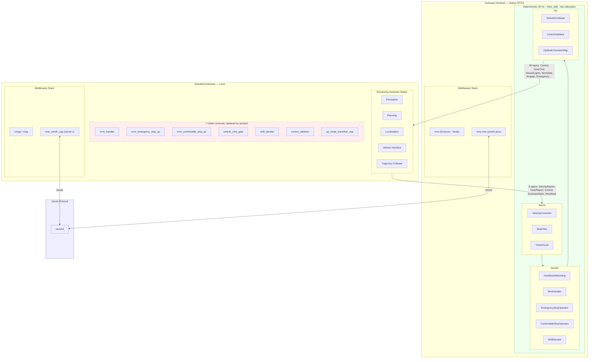

# Autoware Sentinel

An independent safety island for autonomous vehicles. Ports selected [Autoware](https://autoware.org/)
system and control nodes to [nano-ros](https://github.com/nicosio2/nano-ros), a `#![no_std]`
ROS 2 runtime built for formal verification and real-time safety on embedded systems.

The sentinel runs on a dedicated safety MCU and brings the vehicle to a controlled stop
when the main compute fails. It replaces 7 Autoware nodes with a single Rust binary that
cross-compiles to both Zephyr RTOS (Cortex-M) and Linux.

## What It Does

When the main Autoware compute goes silent (heartbeat timeout), the sentinel:

1. Detects the failure via **heartbeat watchdog**
2. Activates **Minimum Risk Maneuver (MRM)** — emergency or comfortable stop
3. Commands jerk-limited deceleration through the **vehicle command gate**
4. Validates commands against safety limits via **control validator**
5. Manages the **operation mode transition** back to a safe state

All of this happens in a deterministic 30 Hz control loop with no heap allocation.

## Replaced Autoware Nodes

| Node                                | Function                                     |
|-------------------------------------|----------------------------------------------|
| `mrm_handler`                       | MRM orchestrator state machine               |
| `mrm_emergency_stop_operator`       | Jerk-limited hard braking                    |
| `mrm_comfortable_stop_operator`     | Gentle deceleration to stop                  |
| `vehicle_cmd_gate`                  | Command rate limiting and source arbitration |
| `shift_decider`                     | Gear state machine (Drive/Reverse/Park)      |
| `control_validator`                 | Command safety bounds checking               |
| `operation_mode_transition_manager` | Autonomous/manual mode transitions           |

## Architecture



### Topics between Autoware and Sentinel

Autoware publishes, sentinel subscribes (5 topics):

| Topic | Message Type |
|-------|-------------|
| `/vehicle/status/velocity_status` | `VelocityReport` |
| `/vehicle/status/gear_status` | `GearReport` |
| `/control/trajectory_follower/control_cmd` | `Control` |
| `/autoware/state` | `AutowareState` |
| `/api/system/heartbeat` | `Heartbeat` |

Sentinel publishes back to Autoware (30 topics):

| Topic | Message Type | Source |
|-------|-------------|--------|
| `/control/command/control_cmd` | `Control` | VehicleCmdGate |
| `/control/command/gear_cmd` | `GearCommand` | VehicleCmdGate |
| `/control/command/hazard_lights_cmd` | `HazardLightsCommand` | MrmHandler |
| `/control/command/turn_indicators_cmd` | `TurnIndicatorsCommand` | VehicleCmdGate |
| `/control/command/emergency_cmd` | `VehicleEmergencyStamped` | MrmHandler |
| `/system/fail_safe/mrm_state` | `MrmState` | MrmHandler |
| `/api/operation_mode/state` | `OperationModeState` | OpModeTransitionMgr |
| `/api/autoware/get/engage` | `Engage` | VehicleCmdGate |
| `/api/autoware/get/emergency` | `Emergency` | MrmHandler |
| ... | | +21 status/debug topics |

Sentinel also serves `/api/operation_mode/change_to_autonomous` (service).

## Key Design Decisions

- **`#![no_std]` throughout** — all 11 algorithm crates compile to `thumbv7em-none-eabihf`
  with zero heap allocation, enabling deployment on Cortex-M safety MCUs
- **Two-layer architecture** — pure algorithm libraries (no ROS dependency) with a thin
  node wiring layer on top, making every algorithm independently unit-testable
- **Formally verified** — 13 Kani model-checking harnesses prove panic-freedom, NaN safety,
  and bounded convergence; Verus proofs verify state machine invariants
- **NaN-safe by design** — sensor NaN values are treated as "stopped" (safe default) using
  negated floating-point comparisons: `!(x.abs() >= threshold)` instead of `x.abs() < threshold`

## Project Status

| Phase | Focus                                             | Status      |
|-------|---------------------------------------------------|-------------|
| 1     | Foundation (messages + 3 algorithm ports)         | Complete    |
| 2     | Emergency Response (MRM chain)                    | Complete    |
| 3     | Safety Gate (vehicle command gate)                | Complete    |
| 4     | Validation Layer (control validator, twist2accel) | Complete    |
| 5     | Formal Verification (Kani + Verus)                | Complete    |
| 6     | Zephyr Application (single binary)                | In progress |
| 7     | Integration Testing (Autoware planning simulator) | In progress |
| 8     | Topic Parity (match all baseline Autoware topics) | Complete    |
| 9     | Behavioral Verification (output correctness)      | Not started |

See [`docs/roadmap/`](docs/roadmap/) for detailed phase documentation.

## Quick Start

### Prerequisites

- Rust (stable, edition 2024)
- ROS 2 Humble with Autoware 1.5.0 packages (`/opt/autoware/1.5.0/`)
- [nano-ros](https://github.com/nicosio2/nano-ros) at `~/repos/nano-ros/`
- [just](https://github.com/casey/just) command runner

### Build and test

```bash
# Build all algorithm crates
just build

# Run unit tests (130+ tests across 11 crates)
just test

# Run formal verification
just verify          # Kani + Verus
```

### Integration testing

Requires zenohd, ROS 2 `rmw_zenoh_cpp`, and Autoware packages.

```bash
# Run all integration tests
just test-integration

# Run transport smoke tests only (sentinel ↔ ROS 2)
just test-transport

# Run planning simulator tests only
just test-planning
```

### Launch Autoware planning simulator

Requires [play_launch](https://github.com/nicosio2/play_launch) and Autoware map data.

```bash
# Baseline: standard Autoware (all nodes)
just launch-autoware-baseline

# Modified: Autoware with sentinel replacing 7 nodes
# (starts zenohd + filtered Autoware + sentinel binary)
just launch-autoware-modified
```

## Repository Structure

```
src/
├── autoware_stop_filter/           # Velocity stop filter
├── autoware_vehicle_velocity_converter/  # VelocityReport → Twist
├── autoware_shift_decider/         # Gear state machine
├── autoware_mrm_emergency_stop_operator/ # Jerk-limited hard braking
├── autoware_mrm_comfortable_stop_operator/ # Gentle deceleration
├── autoware_heartbeat_watchdog/    # Main compute heartbeat monitor
├── autoware_mrm_handler/           # MRM orchestrator
├── autoware_vehicle_cmd_gate/      # Rate limiting + source arbitration
├── autoware_twist2accel/           # Velocity → acceleration estimator
├── autoware_control_validator/     # Command safety validation
├── autoware_operation_mode_transition_manager/ # Mode transitions
├── verification/                   # Verus formal proofs
├── autoware_sentinel/              # Zephyr RTOS application
└── autoware_sentinel_linux/        # Linux native binary
tests/                              # Integration tests (nextest)
docs/roadmap/                       # Phase documentation
```

Each algorithm crate is a standalone package with auto-generated message types.
No root Cargo workspace — each crate builds independently.

## License

Apache-2.0
