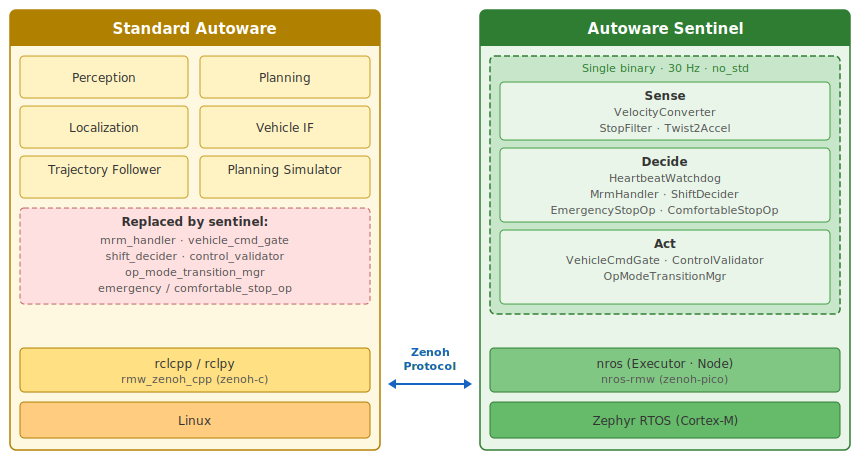

# Autoware Safety Island

## Building a Fail-Safe Companion with nano-ros

Hsiang-Jui (Jerry) Lin, National Taiwan University

---

## 1. Why a Safety Island?

The main compute runs hundreds of nodes on Linux — complex, non-deterministic, hard to certify.

**If it hangs, who stops the car?**

An independent MCU that monitors the main compute and brings the vehicle to a controlled stop.

|                   | Main Compute         | Safety Island     |
|-------------------|----------------------|-------------------|
| **Hardware**      | Cortex-A (Orin, x86) | Cortex-M/R (MCU)  |
| **OS**            | Linux                | RTOS / bare-metal |
| **Complexity**    | Millions of LOC      | Single binary     |
| **Certification** | QM–ASIL B            | ASIL C/D target   |
| **Failure mode**  | Detectable           | Must not fail     |

> Industry practice: NVIDIA DRIVE [1], Apex.AI [2], eSOL eMCOS [3] all use this pattern.

---

## 2. Autoware Sentinel — Our Reference Implementation

A single `#![no_std]` Rust binary replacing 7 Autoware safety nodes.
30 Hz deterministic loop. Zero heap allocation.



**Sense → Decide → Act:**

- Heartbeat watchdog detects main compute failure (500 ms timeout)
- MRM handler activates emergency or comfortable stop
- Vehicle command gate enforces rate/jerk limits
- Control validator checks safety bounds before actuator output

5 topics in (from Autoware), 30 topics out (to vehicle).
Connected via Zenoh (rmw_zenoh on both sides).

---

## 3. nano-ros: The Foundation

A `no_std` ROS 2 runtime for embedded real-time systems.

**API compatible** — same programming model across languages:

```rust
// Rust (rclrs-compatible)
let mut node = executor.create_node("safety")?;
let pub_ = node.create_publisher::<Control>("/cmd")?;
let _sub = node.create_subscription("/vel", |msg: VelocityReport| { ... })?;
```

```c
// C (rclc-compatible)
nros_node_t node;
nros_publisher_t pub;
nros_create_node(&node, &exec, "safety");
nros_create_publisher(&pub, &node, "/cmd", control_ts);
```

| | Support |
|---|---|
| **Languages** | Rust, C, freestanding C++14 |
| **Platforms** | POSIX, Zephyr, FreeRTOS, NuttX, ThreadX, bare-metal |
| **RMW** | zenoh-pico, DDS-XRCE |
| **Transport** | TCP, UDP, serial (UART), IVC |
| **Dev/test** | Full stack runs in QEMU — no hardware needed |

---

## 4. Why Rust for Safety-Critical Embedded?

**`no_std` + alloc-free = bare-metal native.**
No runtime, no GC, no hidden allocations. The entire binary is statically analyzable.

**`async/await` with vendored runtime** — the runtime is a library, not the language:

```rust
// RTIC: interrupt-driven tasks with async/await on Cortex-M
#[task(local = [executor], priority = 1)]
async fn net_poll(cx: net_poll::Context) {
    loop {
        cx.local.executor.spin_once(0);   // non-blocking I/O
        Mono::delay(10.millis()).await;    // yields to lower-priority work
    }
}

#[task(local = [publisher], priority = 2)]  // preempts net_poll
async fn publish(cx: publish::Context) {
    // This task runs at higher priority — guaranteed to meet deadline
    publisher.publish(&Control { velocity: 0.0 })?;
}
```

**Rich ecosystem:** 4,000+ crates on crates.io for `no_std`. Community-maintained HAL traits, drivers, and board support packages.

---

## 5. Execution Safety: RTIC

RTIC (Real-Time Interrupt-driven Concurrency) — a priority-based preemptive scheduler backed by formal theory [4].

| Property | How |
|---|---|
| **Deadlock-free** | Stack Resource Policy (SRP) [5] — proven at compile time |
| **No priority inversion** | Priority ceiling computed statically |
| **Zero-overhead dispatch** | Tasks are hardware interrupts, not OS threads |
| **WCET-analyzable** | Each task is bounded, no unbounded blocking |
| **Race-free** | Shared resources locked via priority ceiling, enforced by type system |

No RTOS kernel needed. The hardware NVIC *is* the scheduler.

```
Priority 3 ──────┐             ┌── brake_check()     ← highest, never delayed
Priority 2 ──────┤  preempts   ├── control_loop()
Priority 1 ──────┘             └── net_poll()         ← lowest, yields via await
```

---

## 6. Formal Verification: Miri, Kani, Verus

Three tools, three scopes — all run on the actual Rust source code.

**Miri** — runtime UB detector (runs test suite under interpreter)
- Catches: use-after-free, uninitialized reads, unbounded loops, integer overflow

**Kani** — bounded model checking (exhaustive for all inputs up to a bound)

```rust
#[kani::proof]
#[kani::unwind(301)]
fn convergence_from_20_mps() {
    let mut op = EmergencyStopOperator::new(Params::default());
    op.set_initial_velocity(20.0);  // 72 km/h
    op.operate(true);

    let dt = 1.0 / 30.0;
    let mut step = 0u32;
    while op.velocity() > 0.0 && step < 300 {
        op.update(dt);
        step += 1;
    }
    assert!(op.velocity() == 0.0, "must reach zero");  // ← proved for ALL f32 paths
}
```

**Verus** — unbounded deductive proofs (mathematical guarantees, zero runtime cost)

```rust
proof fn ramp_phase_terminates(s: DecelState)
    requires s.acceleration_mms2 > TARGET_ACCEL_MMS2,
    ensures ({
        let next = decel_step(s);
        next.acceleration_mms2 < s.acceleration_mms2
            || next.acceleration_mms2 == TARGET_ACCEL_MMS2,
    })
```
Verus proofs live alongside production code and verify end-to-end properties:
reliability, latency bounds, state machine invariants.

---

## 7. Network Safety & Target Platforms

### TSN: Deterministic Network Guarantees

| Standard | What it does | Safety value |
|---|---|---|
| 802.1AS | Sub-microsecond time sync | Coordinated scheduling |
| 802.1Qbv | Scheduled traffic windows | Provable worst-case latency |
| 802.1Qci | Per-stream policing | Babbling idiot protection (FFI) |
| 802.1CB | Frame replication | Seamless redundancy |

ThreadX + NetX Duo [6] provides a complete TSN stack today.
Hardware required: TSN-capable Ethernet MAC (e.g., NXP S32K3 [7], i.MX RT1180).
IEEE 802.1DG-2025 defines the automotive TSN profile [8].
nano-ros adds E2E safety on top: CRC-32 + sequence tracking (AUTOSAR E2E compatible [9]).

### Target Platforms

| Platform | MCU | Transport | Status |
|---|---|---|---|
| QEMU MPS2-AN385 | Cortex-M3 | Ethernet / Serial | Working (dev/test) |
| Zephyr native_sim | x86_64 | POSIX sockets | Working (CI) |
| **NVIDIA Orin SPE** | Cortex-R5F | IVC (shared memory) | Planned |
| **NXP S32K3** | Cortex-M7 lockstep | TSN Ethernet | Planned (ASIL D) |

---

## 8. Discussion

**Open questions for the working group:**

- Which Autoware nodes belong on the safety island?
  - Current 7 system nodes? Add trajectory followers? Fewer?
- What ASIL level should the safety island target?
  - Drives tool qualification, hardware selection, V&V effort
- Preferred hardware platform?
  - Orin SPE (co-located) vs. external automotive MCU (NXP S32K3) vs. both?
- TSN adoption timeline?
  - Standard Ethernet is simpler; TSN adds determinism guarantees
- Integration with Autoware CI?
  - Sentinel tested against planning simulator today — how to make this continuous?

**Resources:**

- nano-ros: https://github.com/nicosio2/nano-ros
- Safety island architecture study: `docs/research/autoware-safety-island-architecture.md`
- TSN assessment: `docs/research/tsn-safety-island-assessment.md`
- ISO 26262 gap analysis: `docs/research/autosar-iso26262-gap-analysis.md`

**References:**

- [1] NVIDIA, "DRIVE OS 6.0 Safety Documentation," NVIDIA Developer, 2024. Orin SoC includes on-chip safety island (4x Cortex-R52 DCLS) with separate clock/power for ASIL D functions.
- [2] Apex.AI, "Apex.OS — ISO 26262 ASIL D Certified ROS 2," AWF TSC, April 2021. ~14 person-years certification effort, 300 requirements, 100% MC/DC coverage. Runs on QNX / INTEGRITY / PikeOS.
- [3] eSOL, "eMCOS POSIX — ISO 26262 ASIL D Certified RTOS," eSOL Co., Ltd. Multi-kernel POSIX PSE 53 architecture; Autoware ports from Linux with minimal effort.
- [4] RTIC Framework, https://rtic.rs/. Hardware-accelerated real-time task scheduler for Cortex-M using the NVIC as a priority-based preemptive dispatcher.
- [5] T. P. Baker, "A Stack-Based Resource Allocation Policy for Realtime Processes," *Proc. IEEE Real-Time Systems Symposium*, 1990. Proves deadlock-freedom and bounded priority inversion for single-processor systems.
- [6] Eclipse ThreadX, "NetX Duo — TSN APIs," https://github.com/eclipse-threadx/netxduo. Open-source (MIT) TCP/IP + TSN stack with 802.1AS, 802.1Qbv support.
- [7] NXP, "S32K3 Microcontrollers for General Purpose," https://www.nxp.com/products/processors-and-microcontrollers/s32-automotive-platform/s32k-general-purpose-mcus/s32k3-microcontrollers-for-general-purpose:S32K3. Dual Cortex-M7 lockstep, ASIL D, TSN-capable Ethernet.
- [8] IEEE, "802.1DG-2025 — TSN Profile for Automotive In-Vehicle Ethernet," IEEE Standards Association, 2025. Defines mandatory/optional TSN features for in-vehicle networks.
- [9] AUTOSAR, "E2E Protocol Specification R22-11," AUTOSAR Classic Platform. CRC + sequence counter + data ID for end-to-end communication protection.
